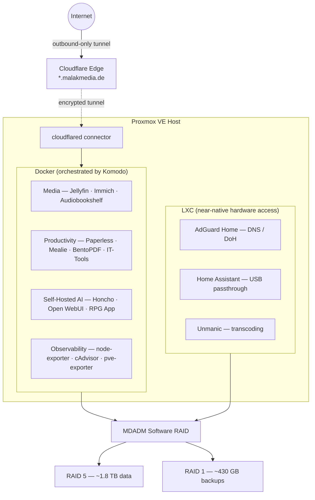

# Homelab Infrastructure and Service Orchestration

This repository documents the architecture and configuration of my Proxmox-based homelab, designed for high availability, secure remote access, and efficient storage utilization. The setup focuses on balancing performance, isolation, and maintainability.

## Topology

## Infrastructure Overview
The environment is managed using Proxmox VE with a hybrid virtualization approach, combining virtual machines and LXC containers.

- **Service Management:** Docker containers are orchestrated via Komodo for streamlined deployment and lifecycle management.
- **Performance Optimization:** Resource-intensive workloads (e.g. video transcoding and network filtering) run inside LXC containers to reduce overhead and allow near-native hardware access.

## Storage Architecture
Storage is managed using MDADM (Linux Software RAID), optimized for a mixed set of 500GB and 1TB drives.

- **Data Array (RAID 5):** ~1.8 TB usable capacity, built from a combination of full disks and partitions to maximize available space while maintaining single-drive fault tolerance.
- **Backup Array (RAID 1):** ~430 GB mirrored array dedicated to critical backups, physically separated from the main data array.
- **Monitoring:** Disk health and S.M.A.R.T. metrics are monitored using Scrutiny.
- **Configuration:** A sanitized array definition is included at [`storage/mdadm.conf.example`](./storage/mdadm.conf.example).

## Networking & Security
The network follows a Zero Trust approach for secure external access.

- **Access Control:** Services are exposed via Cloudflare Tunnels, removing the need for open inbound ports and minimizing the attack surface. A `cloudflared` connector container maintains the outbound-only tunnel to Cloudflare's edge.
- **Traffic Routing:** Incoming traffic is securely routed through encrypted tunnels to internal services using dedicated subdomains under malakmedia.de.
- **Network Filtering:** AdGuard Home (LXC) acts as the primary DNS resolver, providing network-wide ad blocking and DNS-over-HTTPS (DoH).

## Deployed Services

### Administration & Infrastructure
- **Komodo (Docker):** Centralized platform for orchestrating and managing Docker container deployments.
- **Scrutiny (Docker):** Web UI and API for monitoring S.M.A.R.T. data, providing disk health insights and alerting.
- **AdGuard Home (LXC):** Network-wide DNS resolver with ad-blocking, tracking protection, and DNS-over-HTTPS (DoH).
- **Home Assistant (LXC):** Smart home automation platform running in an LXC container for low overhead and direct USB passthrough (e.g. Zigbee/Bluetooth).
- **Cloudflared (Docker):** Cloudflare Tunnel connector providing secure, outbound-only ingress with no exposed inbound ports.
- **Observability (Docker):** Prometheus exporter stack — **node-exporter** (host metrics), **cAdvisor** (per-container metrics), and **prometheus-pve-exporter** (Proxmox VE metrics) — scraped by an external Prometheus/Grafana instance.

### Media & Storage Optimization
- **Jellyfin (Docker):** Self-hosted media server with Intel QuickSync support (/dev/dri) for hardware-accelerated transcoding.
- **Immich (Docker):** Self-hosted photo and video backup with machine-learning features (facial recognition, object/CLIP search) backed by a pgvector database.
- **Audiobookshelf (Docker):** Server for managing, tracking, and streaming audiobooks and podcasts.
- **Unmanic (LXC):** Automated media optimization worker that scans libraries and converts video files to H.265/HEVC to improve storage efficiency.

### Productivity & Utilities
- **Paperless-ngx (Docker):** Document management system with OCR for automated indexing and archiving.
- **Mealie (Docker):** Recipe management and meal planning application.
- **BentoPDF (Docker):** Lightweight web app for local PDF processing (merge, split, compress).
- **IT-Tools (Docker):** Collection of web-based utilities for everyday IT and development tasks.

### Self-Hosted AI
A fully on-premise AI stack — no user or conversation data leaves the network.
- **Honcho (Docker):** Self-hosted, OpenAI-compatible memory and personalization backend (Postgres + pgvector, Redis, and a dedicated embeddings service). Runs locally in place of the hosted cloud so each project's data stays isolated on-prem.
- **Open WebUI (Docker):** Web front-end for interacting with local and API-based LLMs.
- **RPG App (Docker):** A custom, self-built AI-narrated RPG — the largest project in this lab. An **engine-authoritative** design where deterministic Python (~59k LOC, 111 modules, 198 API routes) owns every rule and outcome while a **hybrid, multi-provider AI layer** (Claude / Gemini / DeepSeek, split into foreground narration and background state-parsing) handles prose. Features layered on-prem memory via Honcho, creature evolution and companion systems, a workshop with a visual node-editor, gather/craft/produce economies, and a growing library of **~1,000 custom pixel-art icons** (heading toward ~1,500). → **[Full technical write-up](./docker-compose/rpg-app/README.md)**

## Backup and Disaster Recovery
Data integrity is ensured through a structured and automated backup strategy — see the actual cron in [`scripts/docker-backup.cron`](./scripts/docker-backup.cron):

- **Automation:** A dated tarball of every container's data and compose stack is created daily at **03:00**.
- **Retention:** A **03:30** prune enforces a 7-day rolling retention policy.
- **Storage:** Backup archives are written to a dedicated RAID 1 array, physically separate from the primary data array, ensuring availability in case of primary-array failure.

## Deployment & Reproducibility
- **GitOps-style management:** Komodo watches this repository and deploys each stack from its `docker-compose/<service>/` directory, so the tracked compose files are the source of truth for what runs.
- **Secrets stay out of Git:** every stack ships a committed `*.env.example` (and `pve.yml.example`); real values live in gitignored `.env` / `pve.yml` files on the host only.
- **Pinned images:** application images are pinned to explicit versions for reproducible, deliberate upgrades; only intentionally-rolling tags (e.g. `open-webui:main`, `scrutiny:master-omnibus`, `cloudflared:latest`) track upstream. Datastores (Postgres, Redis, Mongo) are likewise pinned.
- **CI:** every push and PR is linted (yamllint), compose-validated (`docker compose config`), and secret-scanned (gitleaks) via GitHub Actions.

## Security Trade-offs
A homelab balances convenience against isolation; the deliberate trade-offs here are documented rather than hidden:
- **No inbound ports.** All external access is outbound-only through Cloudflare Tunnels; the host exposes nothing to the internet directly.
- **Privileged containers are scoped and understood.** cAdvisor (privileged) and Scrutiny (`SYS_ADMIN`/`SYS_RAWIO`, raw disk devices) require elevated access to read host and disk metrics; Komodo's periphery agent mounts `docker.sock` to manage containers. These are limited to observability/orchestration roles.
- **Internal datastores are not exposed.** Databases and caches bind to loopback or the internal Docker network only and are never published to the LAN.

## Service Endpoints
- **Jellyfin** → https://kino.malakmedia.de  
- **Audiobookshelf** → https://audio.malakmedia.de  
- **BentoPDF** → https://pdf.malakmedia.de
- **IT-Tools** → https://tools.malakmedia.de
