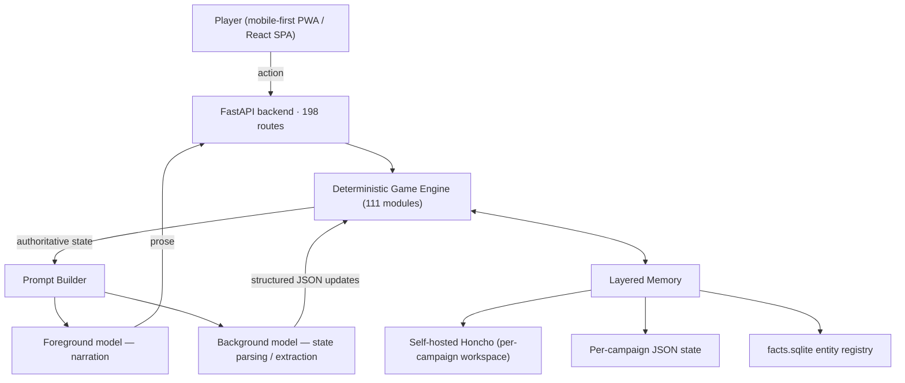

# RPG App — An AI-Narrated, Engine-Authoritative RPG

-8A2BE2)

A persistent, single-player RPG in which **AI handles narration while deterministic
Python systems own every rule, outcome, and piece of state**. The design goal is a
world that feels alive and improvisational, yet stays coherent, fair, and continuous
across campaigns that run for hundreds of turns.

This is my own application — the largest project in this homelab. It runs as the
[`rpg-app`](./docker-compose.yml) container and attaches to the self-hosted
[Honcho](../honcho/) network for on-premise long-term memory.

---

## Design Philosophy: the engine owns the truth

The central rule is a hard separation of concerns:

> **The AI writes the story. The engine decides what actually happens.**

Dice rolls, damage, loot, economy, crafting yields, skill checks, weather, and
progression are all resolved by deterministic Python — never by the language model.
The AI receives the engine's authoritative state and turns it into prose; it is
never allowed to invent mechanics or silently rewrite the world. This keeps a
long campaign internally consistent and prevents the "arbitrary game state" that
makes pure-LLM games feel weightless.

---

## Architecture at a glance

---

## The hybrid AI layer

The app is deliberately **hybrid AI + deterministic code**, and it splits LLM work
across two tiers to balance quality against cost. It is **provider-agnostic** —
Anthropic, Google, and DeepSeek are all wired in and selectable per role.

| Tier | Job | Models used | Why |
|------|-----|-------------|-----|
| **Foreground** | Player-facing narration & dialogue | Claude Sonnet · Gemini Flash · DeepSeek Pro | Prose quality and instruction-following |
| **Background** | State parsing, JSON updates, summaries, entity extraction | Claude Haiku · Gemini Flash-Lite · DeepSeek Flash | Cheap, fast, high-volume |

Engineering details that make this robust:

- **Schema-enforced structured output** — background extraction uses server-side
  `response_schema` so state updates are guaranteed well-formed JSON, not parsed
  out of freeform text.
- **Fail-closed model selection** — an unknown or corrupted model key resolves to
  the *higher-quality* model, so a bad config value can never silently pin
  narration to the cheap tier.
- **Transient-error ret/fallback** — background calls retry and downgrade across
  models on transient provider errors.
- **Per-model usage tracking & reconciliation** — every call is logged and
  cost-accounted, with a reconciliation pass against provider-reported usage.

---

## Layered memory

Long-term coherence comes from three cooperating stores rather than stuffing
everything into a context window:

1. **Self-hosted Honcho** — per-NPC / per-player memory with **one workspace per
   campaign**, so characters remember what they should and campaigns never bleed
   into each other. Runs fully on-prem (no cloud).
2. **Per-campaign JSON state** — the authoritative world snapshot (player, world
   state, economy, quests, factions, businesses, skill chronicle, and more).
3. **`facts.sqlite` entity registry** — a lightweight, queryable record of the
   entities the world has established.

---

## Game systems

All of the following are deterministic engine modules — the AI narrates their
results but does not compute them.

- **Companions & creatures** — XP/leveling, bonding combat bonuses, and equippable
  gear. Creatures progress through **life stages that evolve** (egg → juvenile →
  adult, with stage-specific art and mount stats) driven by the engine.
- **Companion gathering** — companions have per-category aptitude and proficiency,
  can be assigned/paused/resumed on gather tasks, and resolve yields server-side.
- **Workshop & holdings** — production lines with capped module slots and
  tier-based timings, plus a **visual node-editor map**: draggable nodes and
  player-drawn wires (persisted canvas layout) for laying out a production graph.
- **Gather / Craft / Produce loops** — a full economy of gathering raw materials,
  crafting via recipes, and running workshop production over time.
- **Skills** — a single-source-of-truth skill system with a per-campaign skill
  chronicle.
- **Loot & achievements** — tiered loot boxes and an achievement system.
- **Story Director** — a four-part narrative-pacing system (narrative spine,
  adaptive pacing, thread surfacing, and a living antagonist) that shapes long-arc
  structure without seizing mechanical control.
- **Living world** — biome-aware seasonal **weather**, **status effects** and
  weapon specials, **salvage** yield math, economy, contracts, rumors, factions,
  aspirations, and quirks.

---

## Pixel-art identity

Visual identity is a first-class part of the product, not decoration:

- **~1,000 custom pixel-art icons** (996 and counting) — locally AI-generated and
  then **hand-edited** — for items, materials, creatures, and UI.
- **91 hand-placed map tiles** and a portrait/album system.
- A deliberate design language: pixel art as game identity, story-first layout,
  reduced-motion and accessibility support, and visual spectacle **reserved for
  milestones** rather than routine actions.

---

## Engineering signals

| | |
|---|---|
| Backend | Python 3.11, FastAPI, uvicorn — **~59,000 LOC** across **111 core modules** |
| API surface | **198 routes** |
| Frontend | React + TypeScript + Vite SPA, plus an installable **PWA** (service worker, manifest) — mobile-first |
| AI providers | Anthropic, Google Gemini, DeepSeek (OpenAI-compatible), optional local Ollama |
| Memory | Self-hosted Honcho + per-campaign JSON + SQLite entity registry |
| Tests | **67 test files (~11,000 LOC)** covering engine math and game systems |

---

## Deployment

Runs as a single FastAPI container ([`docker-compose.yml`](./docker-compose.yml)),
attached to the external `honcho_default` network so it can reach the self-hosted
memory backend. Configuration and API keys are supplied via `.env` — see
[`.env.example`](./.env.example). Because the game engine is authoritative, the app
is stateless-per-request against its on-disk campaign stores, making restarts and
upgrades safe mid-campaign.
